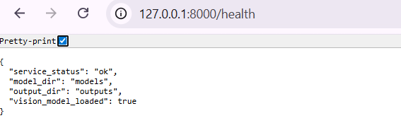
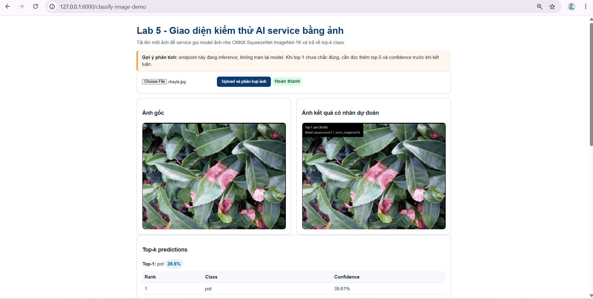
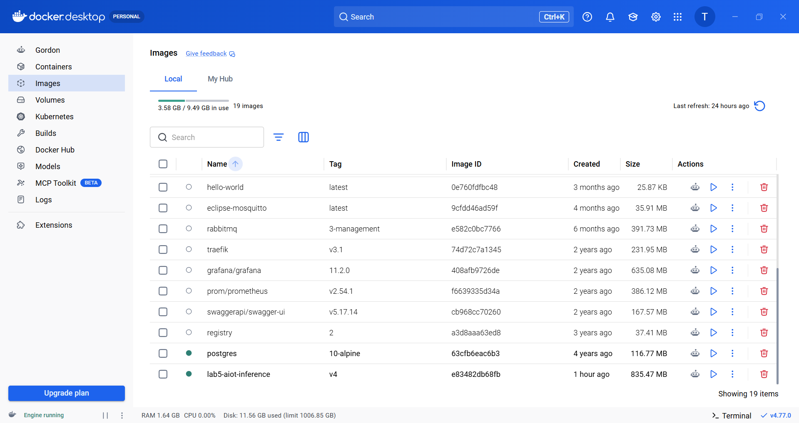
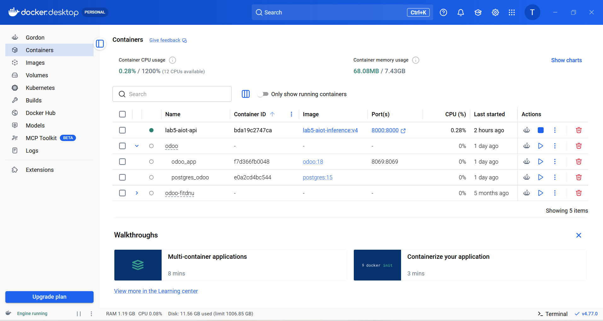
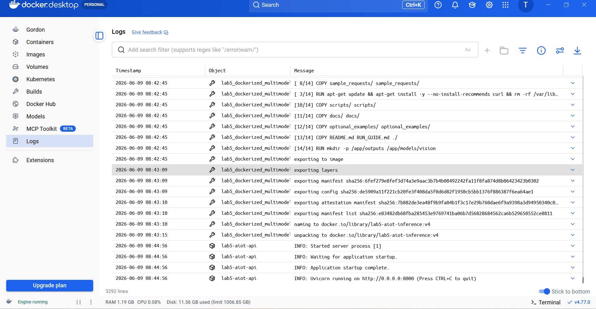
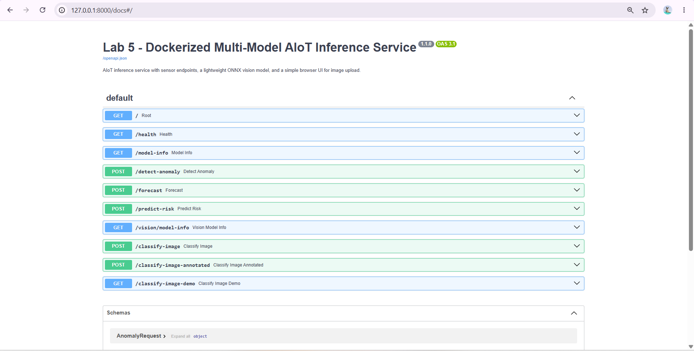
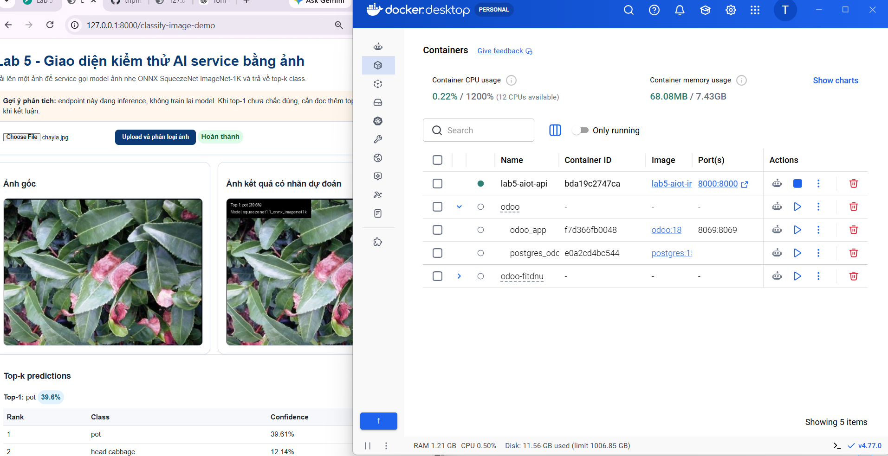
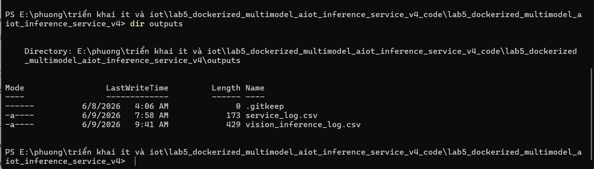

# Lab 5 V4 - Dockerized Multi-Model AIoT Inference Service

Lab 5 V4 dóng gói m?t AI inference service h? tr? c? input telemetry JSON và ?nh upload. D? án dùng FastAPI, Docker, Docker Compose và m?t model ?nh nh? ONNX SqueezeNet ImageNet-1K.

## M?c tiêu

- Ch?y service local b?ng Python + Uvicorn.
- Ch?y service trong Docker container.
- Ch?p ?nh các bu?c ch?y và so sánh k?t qu?.

## Cài d?t và ch?y local

```powershell
python -m venv .venv
.venv\Scripts\activate
pip install -r requirements.txt
python scripts/download_vision_model.py
uvicorn app.main:app --reload
```

M? các endpoint:

- `http://127.0.0.1:8000/health`
- `http://127.0.0.1:8000/docs`
- `http://127.0.0.1:8000/classify-image-demo`

## Build và ch?y Docker

```powershell
docker build -t lab5-aiot-inference:v4 .
docker run --rm --name lab5-aiot-api -p 8000:8000 `
  -v ${PWD}/outputs:/app/outputs `
  -v ${PWD}/models/vision:/app/models/vision `
  lab5-aiot-inference:v4
```

Ho?c dùng Docker Compose:

```powershell
docker compose up --build
docker compose down
```

## So sánh Local và Docker

| Tiêu chí | Local | Docker |
|---|---|---|
| Thi?t l?p | C?n Python, virtualenv, cài dependency | C?n Docker, build image m?t l?n |
| Kh?i d?ng | Nhanh n?u môi tru?ng dã s?n sàng | Ch?m hon khi build image l?n d?u |
| Tri?n khai l?i | C?n install l?i và reload | Ch? c?n rebuild ho?c restart container |
| Môi tru?ng | Ph? thu?c h? th?ng Python | Ðóng gói trong container, d? tái t?o |
| Truy c?p d? li?u | File và logs có th? ghi tr?c ti?p | Dùng volume mount d? gi? d? li?u |
| Ð?ng nh?t | Có th? khác gi?a máy dev | ?n d?nh hon vì image c? d?nh |

## ?nh minh h?a theo th? t? g?i

Các ?nh nên du?c luu vào `docs/screenshots/` v?i các tên sau:

1. `health-local.png` — ?nh k?t qu? `/health` khi ch?y local.
2. `classify-image-demo-local.png` — ?nh giao di?n upload `/classify-image-demo` local.
3. `docker-images.png` — ?nh Docker Desktop Images.
4. `docker-containers.png` — ?nh Docker Desktop Containers Running.
5. `docker-logs.png` — ?nh Docker Desktop Logs.
6. `swagger-docs-container.png` — ?nh Swagger `/docs` khi ch?y container.
7. `classify-image-demo-container.png` — ?nh `/classify-image-demo` khi ch?y container.
8. `outputs-log.png` — ?nh file log trong `outputs/`.

### ?nh 1: Health local



### ?nh 2: Classify image demo local



### ?nh 3: Docker Desktop Images



### ?nh 4: Docker Desktop Containers Running



### ?nh 5: Docker Desktop Logs



### ?nh 6: Swagger docs container



### ?nh 7: Classify image demo container



### ?nh 8: Logs trong outputs



## Thông tin b? sung

- `docs/HUONG_DAN_CHAY_VA_QUAN_SAT.md`
- `docs/docker_environment_comparison.md`
- `docs/docker_desktop_gui_beginner.md`
- `docs/docker_ubuntu_engine_beginner.md`
- `docs/submission_checklist_v4.md`
- `docs/model_formats_for_students.md`

## Smoke test local

```powershell
python scripts/smoke_test_local.py
```

K?t qu? mong d?i:

```text
LOCAL_PIPELINE_TEST_PASS
```

## Ghi chú

N?u b?n mu?n tôi ti?p t?c, hãy luu các ?nh b?n dã g?i vào thu m?c `docs/screenshots/`, tôi s? commit và push ngay l?p t?c.
